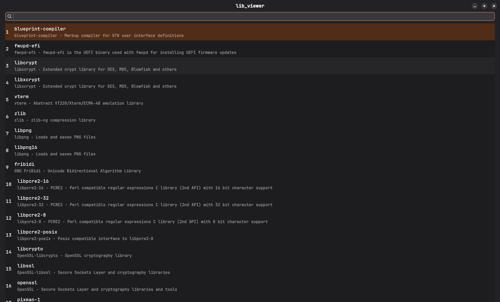
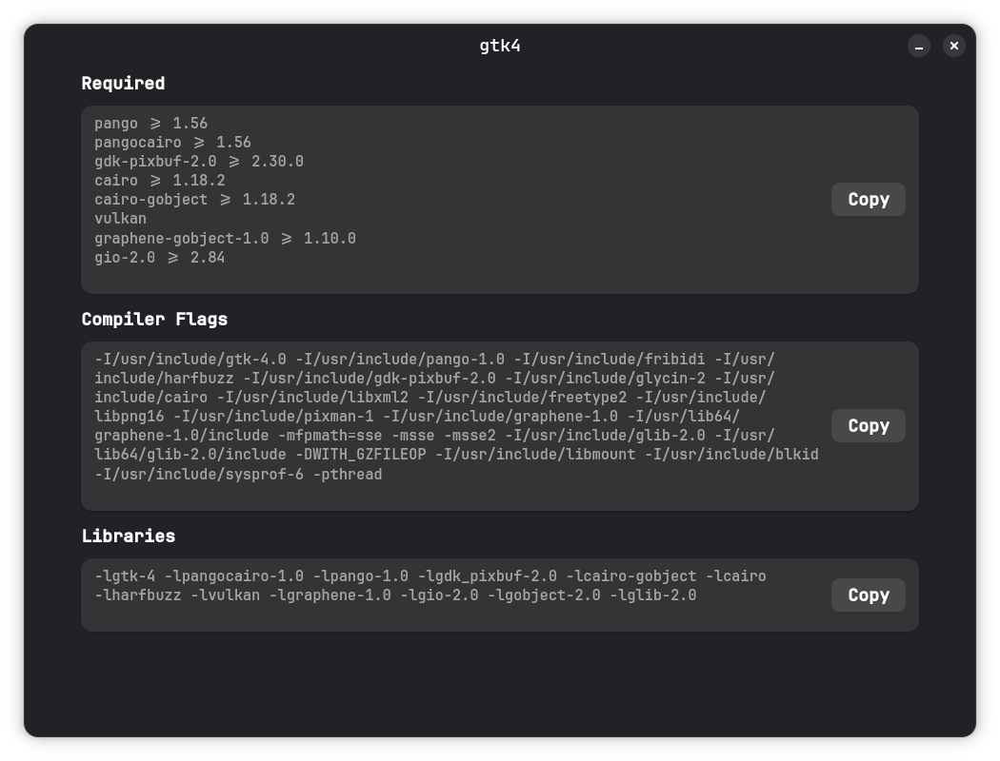

# About:
### `lib_viewer` is a GTK4 and libadwaita based GUI for `pkg-config`. It lets you quickly search the installed packages and view their compilier flags, dependencies, linker flags etc.

-------------------------------------------------------------------------------

# ScreenShots:





-------------------------------------------------------------------------------
# Installation:

### The project uses the `Meson` build system. If Meson and Ninja are not installed on your system, please install them using the instructions for your distribution as well as the required dependencies.

-------------------------------------------------------------------------------

**For Debian based distros**
```
sudo apt install meson ninja-build libgtk-4-dev libadwaita-1-dev
```

**For Arch based distros**
```
sudo pacman -S meson ninja gtk4 libadwaita
```

**For Fedora**

```
sudo dnf install meson ninja-build gtk4-devel libadwaita-devel
```

-------------------------------------------------------------------------------

## Building:
```
git clone https://github.com/Dedacc/lib_viewer.git
cd lib_viewer
meson setup _build
meson compile -C _build
./_build/lib_viewer
```

-------------------------------------------------------------------------------

# Future Plans

## The scope of improvement is vast, but I will list the top ones:


* Move the widget construction to XML.
* Make subprocess communication asynchronous for better performance.
* Improve the widget structure.
* Refine and improve the UI.

-------------------------------------------------------------------------------


# Contribution

**Any improvemental MR is most welcome, if you want to see any improvement please raise an issue regarding the idea.**
